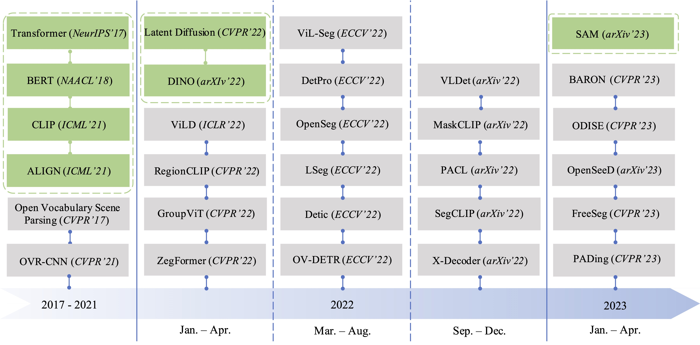

 

  <h1 align="center">Towards Open Vocabulary Learning: A Survey</h1>
  

    arXiv, 2023
     
    <a href="https://jianzongwu.github.io/"><strong>Jianzong Wu</strong></a>
    .
    <a href="https://lxtgh.github.io/"><strong>Xiangtai Li</strong></a>
    ·
    <a href="https://xushilin1.github.io/"><strong>Shilin Xu</strong></a>
    ·
    <a href="https://yuanhaobo.me/"><strong>Haobo Yuan</strong></a>
    ·
    <a href="https://henghuiding.github.io/"><strong>Henghui Ding</strong></a>
    ·
    <a><strong>Yibo Yang</strong></a>
    ·
    <a><strong>Xia Li</strong></a>
    ·
    <a><strong>Jiangning Zhang</strong></a>
    ·
    <a><strong>Yunhai Tong</strong></a>
    ·
    <a><strong>Xudong Jiang</strong></a>
    ·
    <a><strong>Bernard Ghanem</strong></a>
    ·
    <a><strong>Dacheng Tao</strong></a>
    ·
  

  

    
  

 

This repo is used for recording, tracking and benchmarking several recent open vocabulary methods, as a supplement for our [survey]().  
If you find any work missing or have any suggestions (papers, implementations and other resources), feel free to [pull requests](https://github.com/jianzongwu/Awesome-Open-Vocabulary/pulls).
We will add the missing papers in this repo ASAP.

### 🔥Highlight!!

[1] 

## Introduction

In this survey, we present the first detailed survey on the Open Vocabulary tasks, including open vocabulary object detection, open vocabulary segmentation and 3D/video open vocabulary tasks.

## Summary of Contents

- [Introduction](#introduction)
- [Summary of Contents](#summary-of-contents)
- [Methods: A Survey](#methods-a-survey)
  - [Open Vocabulary Object Detection](#open-vocabulary-object-detection)
  - [Open Vocabulary Segmentation](#open-vocabulary-segmentation)
    - [Semantic Segmentation](#semantic-segmentation)
    - [Instance Segmentation](#instance-segmentation)
    - [Panoptic Segmentation](#panoptic-segmentation)
  - [Open Vocabulary Video Understanding](#open-vocabulary-video-understanding)
  - [Open Vocabulary 3D Scene Understanding](#open-vocabulary-3d-scene-understanding)
- [Related Domains and Beyond](#related-domains-and-beyond)
  - [Class-agnostic Detection and Segmentation](#class-agnostic-detection-and-segmentation)
  - [Open-World Object Detection](#open-world-object-detection)
  - [Open-Set Panoptic Segmentation](#open-set-panoptic-segmentation)

## Methods: A Survey

**Keywords**

- `cap.`: Use caption as auxiliary training data
- `vlm.`: Use pretrained VLMs like CLIP 
- `pl.`: Generate pseudo labels
- `w/o ps.`: Training without pixel-level supervision
- `pre.`: Vision-language pretraining
- `diff.`: Use diffusion models
- `unify`: Unify several tasks (semantic segmentation, instance segmentation, and panoptic segmentation)
- `sam`: Use SAM (Segment Anything Model)
- `open.`: Demonstrated with open-set capability. (only for Video Understanding)
- `audio.`: With audio modality.
- `other`: Other methods that cannot be grouped into above ones.

### Open Vocabulary Object Detection

|Year|Venue|Keywords|Paper Title|Code/Project|
|:-:|:-:|:-:|-|-|
|2021|CVPR|`cap.`|[Open-Vocabulary Object Detection Using Captions](https://arxiv.org/abs/2011.10678)|[Code](https://github.com/alirezazareian/ovr-cnn)|
|2021|arXiv|`cap.`, `vlm.`, `pre.`|[RegionCLIP: Region-based Language-Image Pretraining](https://arxiv.org/abs/2112.09106)|[Code](https://github.com/microsoft/RegionCLIP)|
|2022|CVPR|`vlm.`|[Learning to Prompt for Open-Vocabulary Object Detection with Vision-Language Model](https://arxiv.org/abs/2203.14940)|[Code](https://github.com/dyabel/detpro)|
|2022|ICLR|`vlm.`|[Open-vocabulary Object Detection via Vision and Language Knowledge Distillation](https://arxiv.org/abs/2104.13921)|[Code](https://github.com/tensorflow/tpu/tree/master/models/official/detection/projects/vild)|
|2022|GCPR|`cap.`|[Localized Vision-Language Matching for Open-vocabulary Object Detection](https://arxiv.org/abs/2205.06160)|[Code](https://github.com/lmb-freiburg/locov)|
|2022|ECCV|`vlm.`|[Open-Vocabulary DETR with Conditional Matching](https://arxiv.org/abs/2203.11876)|[Code](https://github.com/yuhangzang/OV-DETR)|
|2022|ECCV|`vlm.`, `cap.`, `pl.`|[Open Vocabulary Object Detection with Pseudo Bounding-Box Labels](https://arxiv.org/abs/2111.09452)|[Code](https://github.com/salesforce/PB-OVD)|
|2022|ECCV|`vlm.`|[Promptdet: Towards open-vocabulary detection using uncurated images](https://arxiv.org/abs/2203.16513)|[Code](https://github.com/fcjian/PromptDet)|
|2022|ECCV|`vlm.`, `pl.`, `w/o ps.`|[Detecting Twenty-thousand Classes using Image-level Supervision](https://arxiv.org/abs/2201.02605)|[Code](https://github.com/facebookresearch/Detic)|
|2022|ECCV|`vlm.`. `pl.`|[Exploiting unlabeled data with vision and language models for object detection](https://arxiv.org/abs/2207.08954)|[Code](https://github.com/xiaofeng94/VL-PLM)|
|2022|ECCV|`vlm.`, `cap.`|[Simple Open-Vocabulary Object Detection with Vision Transformers](https://arxiv.org/abs/2205.06230)|[Code](https://github.com/google-research/scenic/tree/main/scenic/projects/owl_vit)|
|2022|NeurIPS|`vlm.`, `pl.`|[Bridging the Gap between Object and Image-level Representations for Open-Vocabulary Detection](https://arxiv.org/abs/2207.03482)|[Code](https://github.com/hanoonaR/object-centric-ovd)|
|2022|NeurIPS|`vlm.`, `cap.`|[DetCLIP: Dictionary-Enriched Visual-Concept Paralleled Pre-training for Open-world Detection](https://arxiv.org/abs/2209.09407)|N/A|
|2022|arXiv|`vlm.`, `cap.`|[Open-Vocabulary One-Stage Detection with Hierarchical Visual-Language Knowledge Distillation](https://arxiv.org/abs/2203.10593)|[Code](https://github.com/mengqiDyangge/HierKD)|
|2022|arXiv|`vlm.`|[Open Vocabulary Object Detection with Proposal Mining and Prediction Equalization](https://arxiv.org/abs/2206.11134)|[Code](https://github.com/peixianchen/MEDet)|
|2022|arXiv|`vlm.`, `pl.`|[P3OVD: Fine-grained Visual-Text Prompt-Driven Self-Training for Open-Vocabulary Object Detection](https://arxiv.org/abs/2211.00849)|N/A|
|2022|arXiv|`vlm.`, `pl.`|[Learning Object-Language Alignments for Open-Vocabulary Object Detection](https://arxiv.org/abs/2211.14843)|[Code](https://github.com/clin1223/VLDet)|
|2023|ICLR|`vlm.`|[F-VLM: Open-Vocabulary Object Detection upon Frozen Vision and Language Models](https://arxiv.org/abs/2209.15639)|[Code](https://github.com/google-research/google-research/tree/master/fvlm)|
|2023|CVPR|`other.`|[Learning to Detect and Segment for Open Vocabulary Object Detection](https://arxiv.org/abs/2212.12130)|N/A|

### Open Vocabulary Segmentation

|Year|Venue|Keywords|Paper Title|Code/Project|
|:-:|:-:|:-:|-|-|
|2023|CVPR|`unify.`, `vlm.` |[FreeSeg: Unified, Universal and Open-Vocabulary Image Segmentation](https://arxiv.org/abs/2303.17225)|[Code](https://github.com/bytedance/FreeSeg)|

#### Semantic Segmentation

|Year|Venue|Keywords|Paper Title|Code/Project|
|:-:|:-:|:-:|-|-|
|2022|ICLR|`vlm.`|[Language-driven Semantic Segmentation](https://arxiv.org/abs/2201.03546)|[Code](https://github.com/isl-org/lang-seg)|
|2022|CVPR|`cap.`, `w/o ps.`|[GroupViT: Semantic Segmentation Emerges from Text Supervision](https://arxiv.org/abs/2202.11094)|[Code](https://github.com/NVlabs/GroupViT)|
|2022|CVPR|`vlm.`|[ZegFormer: Decoupling Zero-Shot Semantic Segmentation](https://arxiv.org/abs/2112.07910)|[Code](https://github.com/dingjiansw101/ZegFormer)|
|2022|ECCV|`cap.`, `vlm.`|[Scaling Open-Vocabulary Image Segmentation with Image-Level Labels](https://arxiv.org/abs/2112.12143)|N/A|
|2022|ECCV|`vlm`, `pl`, `w/o ps.`|[Extract Free Dense Labels from CLIP](https://arxiv.org/abs/2112.01071)|[Code](https://github.com/chongzhou96/MaskCLIP)|
|2022|ECCV|`vlm.`|[A Simple Baseline for Open-Vocabulary Semantic Segmentation with Pre-trained Vision-Language Model](https://arxiv.org/abs/2112.14757)|[Code](https://github.com/MendelXu/zsseg.baseline)|
|2022|ECCV|`vlm.`, `cap.`, `w/o ps.`|[Open-world Semantic Segmentation via Contrasting and Clustering Vision-Language Embedding](https://arxiv.org/abs/2207.08455)|N/A|
|2022|BMVC|`vlm.`|[Open-vocabulary Semantic Segmentation with Frozen Vision-Language Models](https://arxiv.org/abs/2210.15138)|[Code](https://github.com/chaofanma/Fusioner)|
|2022|arXiv|`vlm.`, `cap.`, `pl`, `w/o ps.`|[SegCLIP: Patch Aggregation with Learnable Centers for Open-Vocabulary Semantic Segmentation](https://arxiv.org/abs/2211.14813)|[Code](https://github.com/ArrowLuo/SegCLIP)|
|2022|arXiv|`vlm.`, `cap.`, `w/o ps.`|[Open Vocabulary Semantic Segmentation with Patch Aligned Contrastive Learning](https://arxiv.org/abs/2212.04994)|N/A|
|2023|CVPR|`vlm.`, `pre.`|[Generalized Decoding for Pixel, Image, and Language](https://arxiv.org/abs/2212.11270)|[Code](https://github.com/microsoft/X-Decoder/tree/main)|
|2023|CVPR|`vlm.`, `pl.`|[Open-Vocabulary Semantic Segmentation with Mask-adapted CLIP](https://arxiv.org/abs/2210.04150)|[Code](https://github.com/facebookresearch/ov-seg)|
|2023|CVPR|`cap.`, `vlm.`, `w/o ps.`|[Learning Open-vocabulary Semantic Segmentation Models From Natural Language Supervision](https://arxiv.org/abs/2301.09121)|[Code](https://github.com/Jazzcharles/OVSegmentor/)|
|2023|CVPR|`vlm.`|[Side Adapter Network for Open-Vocabulary Semantic Segmentation](https://arxiv.org/abs/2302.12242)|[Codd](https://github.com/MendelXu/SAN)|
|2023|arXiv|`vlm.`, `unify`|[A Simple Framework for Open-Vocabulary Segmentation and Detection](https://arxiv.org/abs/2303.08131)|[Code](https://github.com/IDEA-Research/OpenSeeD)|
|2023|arXiv|`vlm.`|[Global Knowledge Calibration for Fast Open-Vocabulary Segmentation](https://arxiv.org/abs/2303.09181)|N/A|
|2023|arXiv|`vlm.`|[CAT-Seg: Cost Aggregation for Open-Vocabulary Semantic Segmentation](https://arxiv.org/abs/2303.11797)|[Code](https://github.com/KU-CVLAB/CAT-Seg)|
|2023|arXiv|`vlm.`, `unify`|[Prompt Pre-Training with Twenty-Thousand Classes for Open-Vocabulary Visual Recognition](https://arxiv.org/abs/2304.04704)|[Code](https://github.com/amazon-science/prompt-pretraining)|
|2023|arXiv|`vlm.`, `unify`|[Segment Everything Everywhere All at Once](https://arxiv.org/abs/2304.06718)|[Code](https://github.com/UX-Decoder/Segment-Everything-Everywhere-All-At-Once)|
|2023|arXiv|`vlm.`|[MVP-SEG: Multi-View Prompt Learning for Open-Vocabulary Semantic Segmentation](https://arxiv.org/abs/2304.06957)|N/A|
|2023|arXiv|`vlm.`|[TagCLIP: Improving Discrimination Ability of Open-Vocabulary Semantic Segmentation](https://arxiv.org/abs/2304.07547)|N/A|
|2023|arXiv|`vlm.`, `w/o ps.`, `sam`|[Exploring Open-Vocabulary Semantic Segmentation without Human Labels](https://arxiv.org/abs/2306.00450)|N/A|
|2023|arXiv|`vlm.`, `unify`|[DaTaSeg: Taming a Universal Multi-Dataset Multi-Task Segmentation Model](https://arxiv.org/abs/2306.01736)|N/A|

#### Instance Segmentation

|Year|Venue|Keywords|Paper Title|Code/Project|
|:-:|:-:|:-:|-|-|
|2022|CVPR|`cap.`, `pl.`, `vlm.`|[Open-Vocabulary Instance Segmentation via Robust Cross-Modal Pseudo-Labeling](https://arxiv.org/abs/2111.12698)|[Code](https://github.com/hbdat/cvpr22_cross_modal_pseudo_labeling)|
|2023|CVPR|`vlm`, `cap`, `w/o ps.`|[Mask-free OVIS: Open-Vocabulary Instance Segmentation without Manual Mask Annotations](https://arxiv.org/abs/2303.16891)|[Code](https://github.com/Vibashan/Maskfree-OVIS)|
|2023|arXiv|`cap.`|[Betrayed by Captions: Joint Caption Grounding and Generation for Open Vocabulary Instance Segmentation](https://arxiv.org/abs/2301.00805)|[Code](https://github.com/jianzongwu/betrayed-by-captions)|
|2023|arXiv|`vlm.`|[OpenVIS: Open-vocabulary Video Instance Segmentation](https://arxiv.org/abs/2305.16835)|N/A|

#### Panoptic Segmentation

|Year|Venue|Keywords|Paper Title|Code/Project|
|:-:|:-:|:-:|-|-|
|2022|arXiv|`vlm`|[Open-Vocabulary Panoptic Segmentation with MaskCLIP](https://arxiv.org/abs/2208.08984)|N/A|
|2023|CVPR|`diff`, `vlm`|[Open-Vocabulary Panoptic Segmentation with Text-to-Image Diffusion Models](https://arxiv.org/abs/2303.04803)|[Code](https://github.com/NVlabs/ODISE)|
|2023|arXiv|`vlm.`|[Open-vocabulary Panoptic Segmentation with Embedding Modulation](https://arxiv.org/abs/2303.11324)|N/A|

### Open Vocabulary Video Understanding

|Year|Venue|Keywords|Acronym|Paper Title|Code/Project|
|:-:|:-:|:-:|:-:|-|-|
|2021|arXiv|`vlm.`,`open.`|ActionCLIP|[ActionCLIP: A New Paradigm for Video Action Recognition](https://arxiv.org/abs/2109.08472)|[Code](https://github.com/sallymmx/ActionCLIP)|
|2022|ECCV|`vlm.`,`open.`|I-VL|[Prompting Visual-Language Models for Efficient Video Understanding](https://arxiv.org/abs/2112.04478)|[Project](https://ju-chen.github.io/efficient-prompt)|
|2022|ECCV|`vlm.`|EVL|[Frozen CLIP Models are Efficient Video Learners](https://arxiv.org/abs/2208.03550)|[Code](https://github.com/OpenGVLab/efficient-video-recognition)|
|2022|ECCV|`vlm.`,`open.`|X-CLIP|[Expanding Language-Image Pretrained Models for General Video Recognition](https://arxiv.org/abs/2208.02816)|[Code](https://aka.ms/X-CLIP)|
|2022|arXiv|`vlm.`,`open.`,`audio.`|MOV|[Multimodal Open-Vocabulary Video Classification via Pre-Trained Vision and Language Models](https://arxiv.org/abs/2207.07646)|N/A|
|2023|AAAI|`vlm.`,`open.`|Text4Vis|[Revisiting Classifier: Transferring Vision-Language Models for Video Recognition](https://arxiv.org/abs/2207.01297)|[Code](https://github.com/whwu95/Text4Vis)|
|2023|ICLR|`vlm.`|AIM|[AIM: Adapting Image Models for Efficient Video Action Recognition](https://arxiv.org/abs/2302.03024)|[Project](https://adapt-image-models.github.io/)|
|2023|CVPR|`vlm.`,`open.`|ViFi-CLIP|[Fine-tuned CLIP Models are Efficient Video Learners](https://arxiv.org/abs/2212.03640)|[Code](https://github.com/muzairkhattak/ViFi-CLIP)|
|2023|ICML|`vlm.`,`open.`|Open-VCLIP|[Open-VCLIP: Transforming CLIP to an Open-vocabulary Video Model via Interpolated Weight Optimization](https://arxiv.org/abs/2302.00624)|[Code](https://github.com/wengzejia1/Open-VCLIP)|
|2023|arXiv|`vlm.`,`open.`|ASU|[Video Action Recognition with Attentive Semantic Units](https://arxiv.org/abs/2303.09756)|N/A|
|2023|arXiv|`vlm.`,`open.`|VicTR|[VicTR: Video-conditioned Text Representations for Activity Recognition](https://arxiv.org/abs/2304.02560)|N/A|
|2023|arXiv|`vlm.`,`open.`|MAXI|[MAtch, eXpand and Improve: Unsupervised Finetuning for Zero-Shot Action Recognition with Language Knowledge](https://arxiv.org/abs/2303.08914)|N/A|

### Open Vocabulary 3D Scene Understanding 

## Related Domains and Beyond

### Class-agnostic Detection and Segmentation

### Open-World Object Detection

|Year|Venue|Paper Title|
|:-:|:-:|-|
|2015|CVPR|[Towards Open World Recognition](https://www.cv-foundation.org/openaccess/content_cvpr_2015/html/Bendale_Towards_Open_World_2015_CVPR_paper.html)|
|2021|CVPR|[Towards Open World Object Detection.](https://arxiv.com/abs/2103.02603)|
|2022|CVPR|[OW-DETR: Open-world Detection Transformer](https://arxiv.org/abs/2112.01513)|
|2022|ECCV|[UC-OWOD: Unknown-Classified Open World Object Detection](https://arxiv.com/abs/2207.11455)|
|2022|arXiv|[Revisiting Open World Object Detection](https://arxiv.org/abs/2201.00471)|
|2022|arXiv|[Rectifying Open-set Object Detection: A Taxonomy, Practical Applications, and Proper Evaluation](https://arxiv.org/abs/2207.09775)|
|2022|arXiv|[Open World DETR: Transformer based Open World Object Detection](https://arxiv.org/abs/2212.02969)|
|2022|arXiv|[PROB: Probabilistic Objectness for Open World Object Detection](https://arxiv.org/abs/2212.01424)|

### Open-Set Panoptic Segmentation

|Year|Venue|Paper Title|
|:-:|:-:|-|
|2021|CVPR|[Exemplar-Based Open-Set Panoptic Segmentation Network](https://arxiv.org/abs/2105.08336)|
|2022|arXiv|[Dual Decision Improves Open-Set Panoptic Segmentation](https://arxiv.org/abs/2207.02504)|